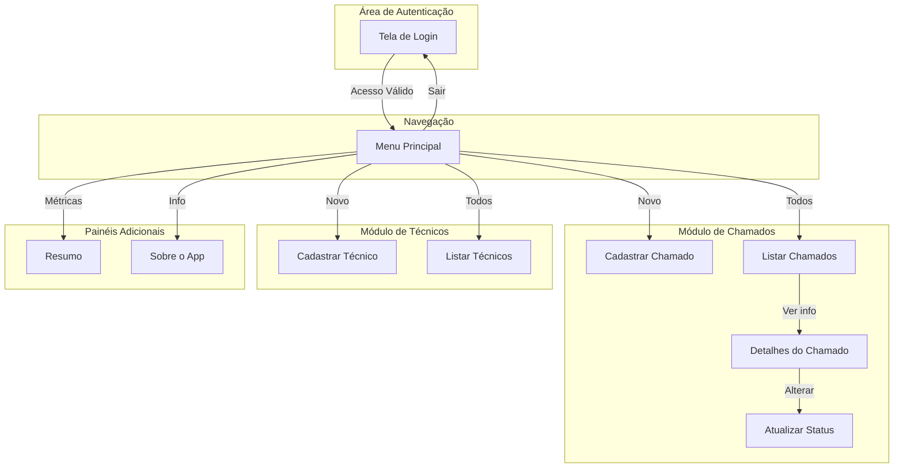
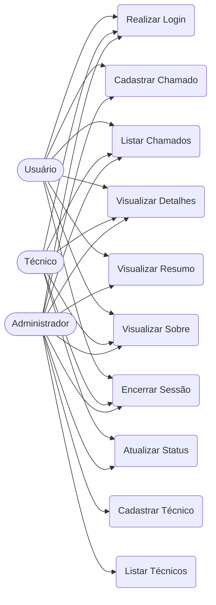
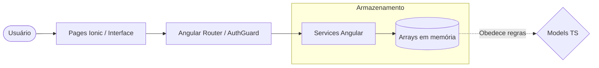
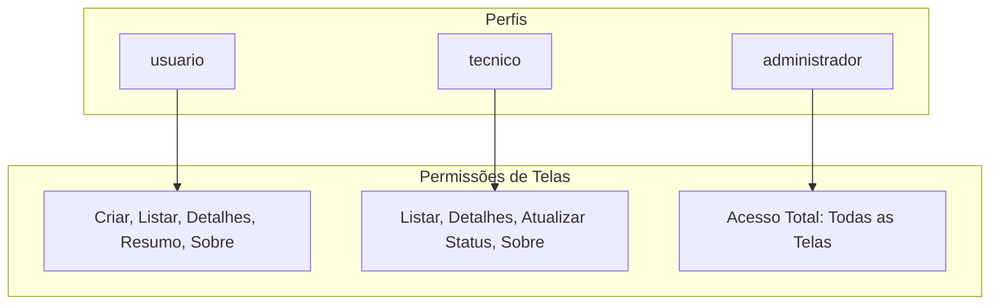
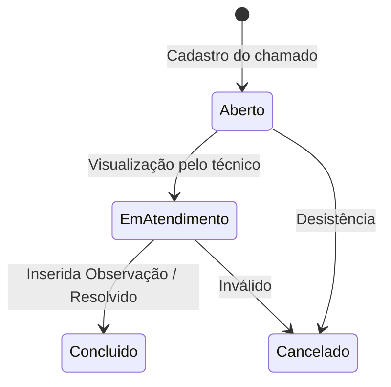
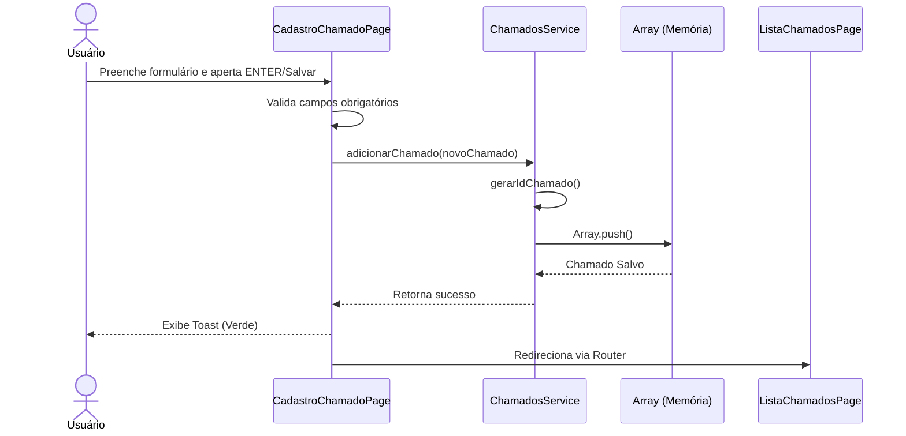

# 1. App de Controle de Chamados Técnicos

## 2. Identificação acadêmica
- **Autor:** Eduardo Henrryk Simonato
- **Disciplina:** Desenvolvimento para Dispositivos Móveis
- **Instituição:** Claretiano
- **Entrega:** Portfólio 2
- **Tecnologia principal:** Ionic/Angular

## 3. Descrição do projeto
O aplicativo foi desenvolvido para o controle de chamados técnicos, permitindo aos usuários realizar o cadastro, listagem, acompanhamento, atualização de status e visualização de resumos quantitativos de forma prática e móvel.

## 4. Objetivo do projeto
O objetivo deste projeto é aplicar os conceitos fundamentais de Ionic, Angular, TypeScript, criação de páginas, controle de rotas, navegação, construção de formulários com `ngModel`, manipulação de arrays, lógica centralizada em services e utilização de componentes visuais modernos do Ionic.

## 5. Observação importante sobre armazenamento
> **Aviso Importante:** Este projeto **não utiliza banco de dados** nem API externa. Ele não faz uso de Firebase, SQLite ou LocalStorage. 
Os dados ficam armazenados **apenas em arrays dentro de services Angular**.
Ao atualizar ou fechar o aplicativo, **os dados podem ser perdidos**.
Isso é esperado e intencional, pois o objetivo puramente acadêmico da entrega é praticar o fluxo de dados em arrays, criação de formulários, navegação e injeção de dependência via services.

## 6. Tecnologias utilizadas
- Ionic
- Angular
- TypeScript
- HTML
- SCSS
- Angular Router
- FormsModule / ngModel
- Services Angular
- Arrays em memória
- Antigravity
- Git
- GitHub

## 7. Funcionalidades principais
- **Login por perfil:** Autenticação baseada em níveis de usuário.
- **Menu principal:** Navegação condicional exibindo apenas opções permitidas pelo perfil.
- **Cadastro de chamados:** Abertura de novos tíquetes técnicos.
- **Listagem de chamados:** Exibição em cards modernos de todos os registros abertos.
- **Detalhes do chamado:** Visão expandida de um chamado específico.
- **Atualização de status:** Mudança do ciclo de vida de um chamado.
- **Cadastro de técnicos:** Registro de profissionais.
- **Listagem de técnicos:** Exibição dos profissionais da equipe.
- **Exclusão de registros:** Remoção manual de tickets e profissionais (com confirmação).
- **Resumo dos chamados:** Dashboard com indicadores do sistema.
- **Tela Sobre:** Créditos e tecnologias.
- **Encerramento de sessão:** Logout e limpeza segura dos dados da sessão.

## 8. Perfis de acesso
O sistema mapeia o acesso em três níveis de usuários (perfis): `usuario`, `tecnico` e `administrador`.

### Perfil `usuario`
- Pode cadastrar chamado
- Pode listar chamados
- Pode visualizar detalhes
- Pode visualizar resumo
- Pode acessar Sobre
- Pode sair
- *Não pode cadastrar técnico*
- *Não pode listar técnicos*
- *Não pode atualizar status*

### Perfil `tecnico`
- Pode listar chamados
- Pode visualizar detalhes
- Pode atualizar status
- Pode acessar Sobre
- Pode sair
- *Não pode cadastrar chamado*
- *Não pode cadastrar técnico*
- *Não pode listar técnicos*
- *Não pode visualizar resumo*

### Perfil `administrador`
- Pode acessar todas as telas e executar todas as ações.

## 9. Dados de login para teste
Para acessar a aplicação, utilize um dos seguintes perfis informando **qualquer valor** no campo de senha (a senha não é validada em banco ou API, ela precisa apenas estar preenchida):
- `usuario` / qualquer senha preenchida
- `tecnico` / qualquer senha preenchida
- `administrador` / qualquer senha preenchida

> **Atenção:** O campo usuário deve ser **exatamente** a string solicitada acima, em letras minúsculas.

## 10. Telas do sistema

| Tela | Rota | Descrição | Perfis com acesso |
|---|---|---|---|
| Login | `/login` | Porta de entrada e identificação. | Todos (deslogados) |
| Menu Principal | `/menu-principal` | Hub de navegação dinâmico. | Todos (logados) |
| Cadastro de Chamado | `/cadastro-chamado` | Formulário para novos tickets. | `usuario`, `administrador` |
| Listagem de Chamados | `/lista-chamados` | Lista de todos os chamados. | Todos |
| Detalhes do Chamado | `/detalhes-chamado/:id` | Visão completa do ticket. | Todos |
| Atualizar Status | `/atualizar-status/:id` | Mudança de fase do ticket. | `tecnico`, `administrador` |
| Cadastro de Técnico | `/cadastro-tecnico` | Formulário de profissionais. | `administrador` |
| Listagem de Técnicos | `/lista-tecnicos` | Lista de profissionais. | `administrador` |
| Resumo de Chamados | `/resumo-chamados` | Painel visual de métricas. | `usuario`, `administrador` |
| Sobre o App | `/sobre` | Tecnologias e autoria. | Todos |

## 11. Estrutura de pastas
A hierarquia central e acadêmica da aplicação (omitindo `node_modules`):
```text
portfolio-2-claretiano/
└── app-controle-chamados-tecnicos/
    ├── docs/
    ├── src/
    │   ├── app/
    │   │   ├── guards/
    │   │   ├── models/
    │   │   ├── pages/
    │   │   └── services/
    │   ├── assets/
    │   ├── environments/
    │   ├── theme/
    │   ├── global.scss
    │   └── index.html
    ├── angular.json
    ├── ionic.config.json
    ├── package.json
    ├── package-lock.json
    └── tsconfig.json
```

## 12. Arquitetura do projeto
- **Pages:** Componentes focados exclusivamente na interface, formulários e interação com o usuário final.
- **Models:** Interfaces em TypeScript que definem a tipagem forte e a estrutura dos dados (Chamados e Técnicos).
- **Services:** Provedores de negócio contendo os arrays em memória e os métodos CRUD. Compartilham dados reativamente.
- **Angular Router:** Gerencia toda a árvore de navegação e ciclo de vida das rotas do Ionic.
- **Menu Principal:** Abstrai a visibilidade de botões baseada em `*ngIf` e orienta para as telas conforme o perfil logado.
- **Sessao Service / AuthGuard:** Trabalham juntos para controlar o estado do ator e proteger invasões diretas por URL em memória.

## 13. Models

### Model `Chamado`
```typescript
{
  id: number;
  solicitante: string;
  setor: string;
  titulo: string;
  descricao: string;
  prioridade: 'Baixa' | 'Média' | 'Alta' | 'Urgente';
  dataAbertura: Date;
  tecnico: Tecnico | null;
  status: 'Aberto' | 'Em atendimento' | 'Concluído' | 'Cancelado';
  observacao?: string;
}
```

### Model `Tecnico`
```typescript
{
  id: number;
  nome: string;
  especialidade: 'Hardware' | 'Software' | 'Rede' | 'Impressora' | 'Sistema interno' | 'Outros';
  contato: string;
  situacao: 'Ativo' | 'Inativo';
}
```

## 14. Services

### Chamados e Tecnicos Service
Fornecem acesso central aos arrays em memória:
- `listarChamados()`
- `adicionarChamado()`
- `buscarChamadoPorId()`
- `excluirChamado()`
- `atualizarStatus()`
- `listarTecnicos()`
- `adicionarTecnico()`
- `excluirTecnico()`
- `gerarIdChamado()`
- `gerarIdTecnico()`
- `listarTecnicosAtivos()`
- `calcularResumoChamados()`

### Sessão Service
- `definirPerfil()`: Memoriza o ator no array temporário.
- `obterPerfil()`: Retorna o ator atual.
- `limparSessao()`: Remove o nível de permissão (logout).
- `temPermissao()`: Avalia se uma rota URL é alcançável pelo ator.

## 15. Validações implementadas

### Login
- Usuário obrigatório
- Senha obrigatória
- Usuário precisa ser estritamente `usuario`, `tecnico` ou `administrador`

### Cadastro de chamado
- Solicitante obrigatório
- Título obrigatório
- Descrição obrigatória
- Prioridade obrigatória
- Técnico obrigatório

### Cadastro de técnico
- Nome obrigatório
- Especialidade obrigatória
- Contato obrigatório

### Atualização de status
- Status obrigatório

## 16. Atalhos de teclado
- **ENTER no Login:** Executa a ação de `Entrar`.
- **ENTER em Formulários:** Executa a submissão / ação principal da tela.
- **ESC em telas internas:** Interrompe modais ou volta para a tela/menu anterior de forma contínua.
- **ESC no Menu Principal:** É ignorado deliberadamente.
- O login só é encerrado pressionando/clicando no botão `Sair` ou `Encerrar Sessão`.

## 17. Como executar o projeto

**Pré-requisitos:**
- Node.js 22.12.0
- npm atualizado
- Ionic CLI global instalado (`npm install -g @ionic/cli`)

**Comandos:**
No terminal de sua preferência, execute:
```bash
npm install
npx ionic serve
```
*(A aplicação ficará disponível em http://localhost:8100 e fará hot-reload a cada modificação.)*

## 18. Como testar o sistema
Para explorar completamente os requisitos entregues, sugere-se a seguinte ordem de passos:
1. Testar login inválido digitando letras aleatórias.
2. Testar login com `usuario` e observar bloqueios de tela.
3. Testar login com `tecnico` e tentar abrir a aba de chamados para atualizar o status.
4. Testar login com `administrador` tendo posse e permissão total.
5. Cadastrar técnico confirmando seus campos via validação Ionic.
6. Listar técnico verificando sua visibilidade e exclusão.
7. Cadastrar chamado.
8. Listar chamado.
9. Visualizar detalhes via passagem de parâmetro de rota.
10. Atualizar status e verificar mudança de cor da badge.
11. Ver resumo no gráfico/painel.
12. Acessar tela Sobre para verificar as informações textuais da aplicação.
13. Encerrar sessão e testar blindagem das rotas.

## 19. Diagramas

### A. Fluxo geral do aplicativo


### B. Casos de uso


### C. Arquitetura do projeto


### D. Permissões por perfil


### E. Fluxo do chamado


### F. Sequência simplificada de cadastro de chamado


### G. Diagrama de Classes/Models
```mermaid
classDiagram
    class Chamado {
      +number id
      +string solicitante
      +string setor
      +string titulo
      +string descricao
      +string prioridade
      +Date dataAbertura
      +string status
      +string observacao
    }
    class Tecnico {
      +number id
      +string nome
      +string especialidade
      +string contato
      +string situacao
    }
    class ChamadosService {
      -Chamado[] chamados
      +listarChamados()
      +adicionarChamado()
      +atualizarStatus()
    }
    class SessaoService {
      -string perfilLogado
      +definirPerfil()
      +obterPerfil()
      +temPermissao()
    }

    Chamado "*" --> "1" Tecnico : Associado
    ChamadosService --> Chamado : Gerencia

## 20. Evidências de funcionamento
Prints das telas e do seu funcionamento geral podem ser adicionados e armazenados posteriormente em `docs/evidencias/` ou `assets/prints/` visando facilitar a visualização da versão entregue.

## 21. Conclusão
O presente aplicativo alcança e entrega com total adequação os propósitos acadêmicos orientados para o Portfólio 2 da disciplina de Desenvolvimento para Dispositivos Móveis. Foram exercitados de ponta a ponta os recursos do framework Ionic em sincronia estrutural com o Angular, implementando rotas seguras, serviços de array e formulários vinculados, suprindo o ambiente prático exigido pela ausência proposital do uso de banco de dados e APIs externas.

## 22. Link do repositório
https://github.com/EduardoHenrrykSimonato/portfolio-2-claretiano
